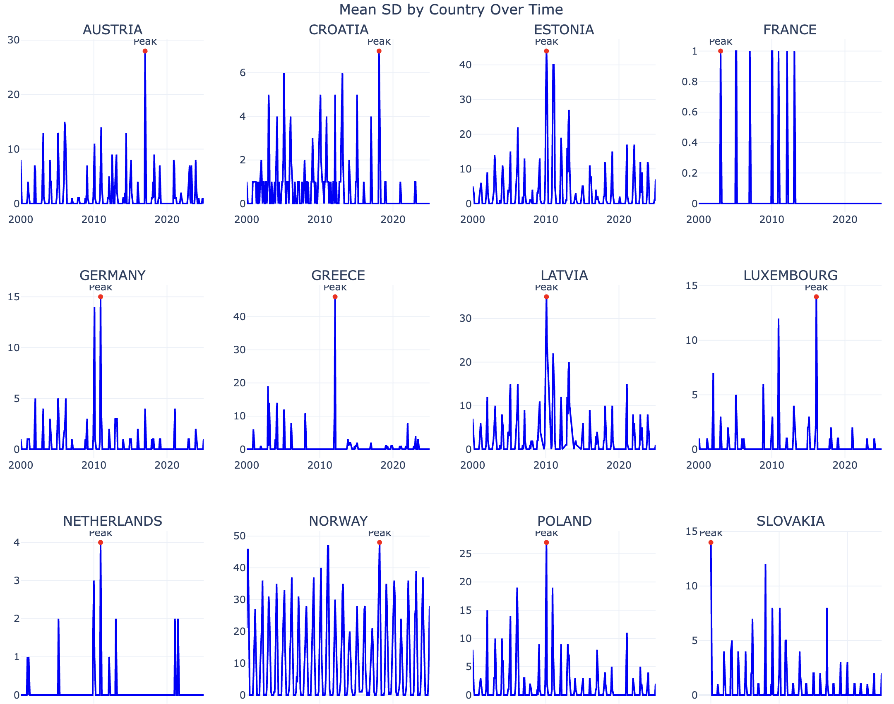
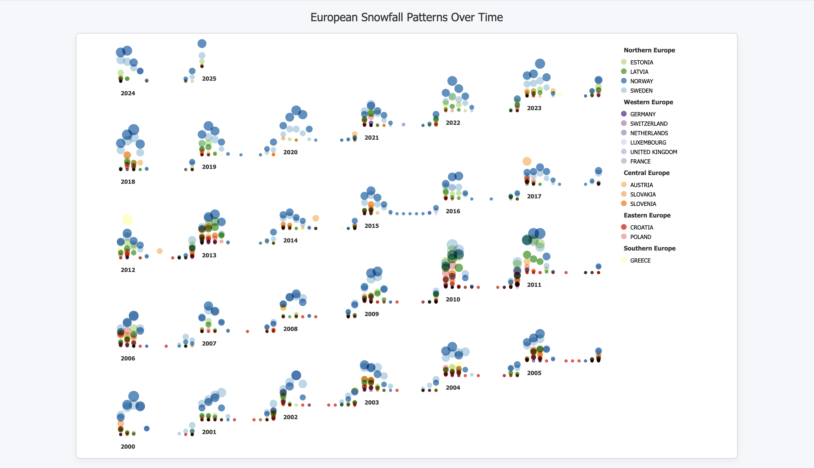
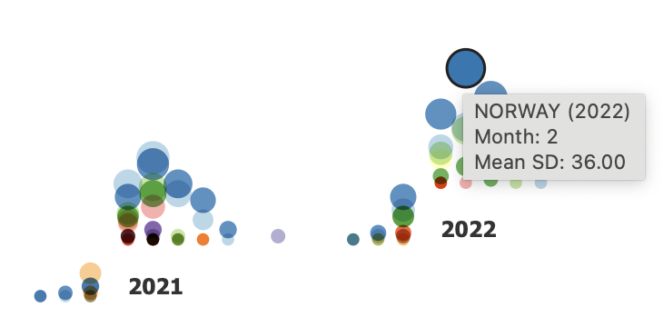
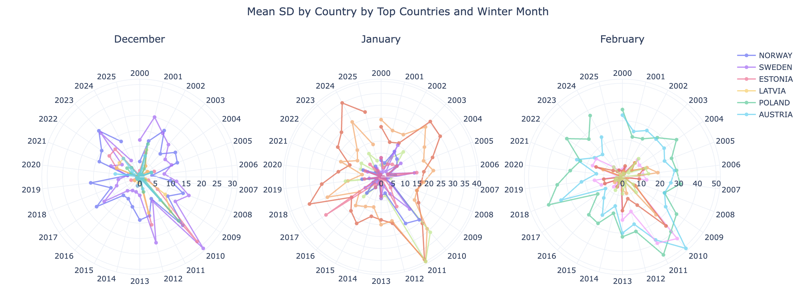
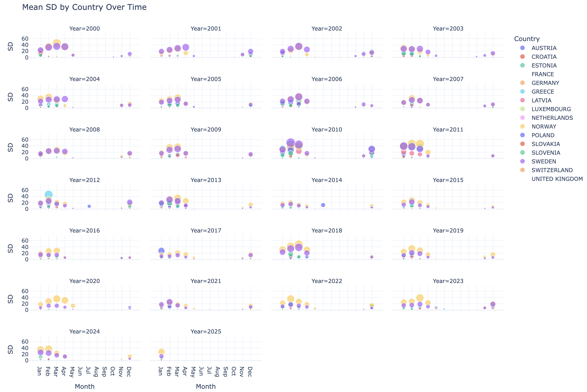

# ❄️ European Snowfall Dynamics — D3.js & Python Visualization

This project explores seasonal snowfall dynamics across 16 European countries over a 25-year period, using a dataset of monthly average snow depth `mean_SD`.

#### 1. Snow Dynamics per Country Over Time

This plot shows per-country snow variation over the years. Each peak reflects the most intense snow month recorded. Countries like Norway and Estonia demonstrate significant variance, while others like France rarely show snow.

#### 2. Bubble Ridge Plot: Monthly Variation by Year

This D3.js visualization illustrates how different countries contribute to snow depth month by month. Each year's row reveals the local winter rhythm. Combined with the following legend...

...we observe that Northern and Eastern European countries dominate high snow months in January and February.

#### 3. Spiral Monthly Evolution

We group December, January, and February snow depths by year and country into three radial spirals. This makes it easier to identify cyclical patterns — for instance, 2010–2012 stands out for exceptionally high snowfall in February across several countries.

#### 4. 🌊 Seasonal Animation

Animated line graphs allow to see the seasonal snow “waves” across time, country by country. The opacity and flow reflect snow buildup and decay over the winter months.

Other dynamic plots and explorations can be found in the following [notebook](notebook/Data_Visualization_Assignment.ipynb). 
Initial processed dataset used in all visualizations [mean_SD_by_country_by_month.csv](src/mean_SD_by_country_by_month.csv). 
D3.js interactive source code and layout [source](src/).

